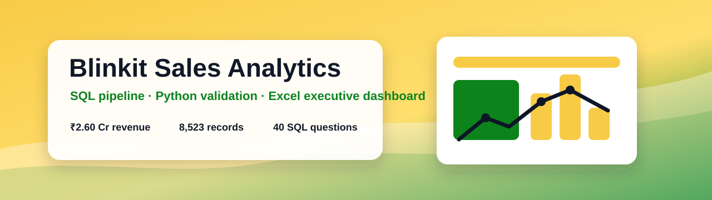
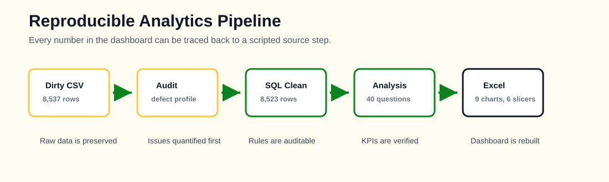

<p align="center">
  
</p>

# Blinkit Sales Analytics Dashboard

**End-to-end retail analytics project — SQL data pipeline, 40 business questions, and an interactive executive dashboard built on 8,523 grocery sales records.**

<p align="center">
  
  
  
  
</p>


---

## Table of Contents

1. [Project Overview](#1-project-overview)
2. [Business Objectives](#2-business-objectives)
3. [Dataset Description](#3-dataset-description)
4. [Tools & Tech Stack](#4-tools--tech-stack)
5. [Project Architecture](#5-project-architecture)
6. [Data Quality Audit](#6-data-quality-audit)
7. [SQL Skills Demonstrated](#7-sql-skills-demonstrated)
8. [Excel Skills Demonstrated](#8-excel-skills-demonstrated)
9. [Dashboard Design Rationale](#9-dashboard-design-rationale)
10. [Business Insights & Recommendations](#10-business-insights--recommendations)
11. [How to Reproduce](#11-how-to-reproduce)
12. [Limitations & Honest Caveats](#12-limitations--honest-caveats)
13. [Future Improvements](#13-future-improvements)
14. [Resume Bullet Points](#14-resume-bullet-points)

---

## 1. Project Overview

Blinkit is an Indian quick-commerce grocery platform. This project analyses **8,523 product-outlet sales records** across **10 outlets**, **16 categories** and **1,392 products** over **24 months (Jan 2022 – Dec 2023)**, and turns them into decisions a category manager, operations lead or expansion team can act on.

It is deliberately structured the way analytics work is actually done in industry:

| Stage | What happens | Deliverable |
|-------|-------------|-------------|
| **Audit** | Profile the raw file, quantify every defect before touching it | `Reports/data_quality_report.md` |
| **Model** | Staging table + typed, constrained, indexed analytics table | `SQL/Database.sql` |
| **Clean** | One auditable, re-runnable transformation with validation | `SQL/Data Cleaning.sql` |
| **Explore** | Baseline KPIs and distributions | `SQL/Exploratory Analysis.sql` |
| **Analyse** | 40 business questions in business language | `SQL/Business Questions.sql` |
| **Advance** | Window functions, CTEs, views, stored procedure, tuning | `SQL/Advanced Analysis.sql` |
| **Visualise** | Interactive dashboard with live PivotTables + slicers | `Excel Dashboard/Blinkit Dashboard.xlsx` |

<p align="center">
  
</p>

**The headline numbers**

| KPI | Value |
|-----|-------|
| Total Revenue | **₹2.60 Cr** (₹25,965,273) |
| Sales Records | 8,523 |
| Average Sale Value | ₹3,046 |
| Median Sale Value | ₹2,397 |
| Average Rating | 4.00 / 5 |
| Products / Categories / Outlets | 1,392 / 16 / 10 |
| YoY Revenue Growth | **+13.6%** |

---

## 2. Business Objectives

This project answers seven questions a real retail leadership team asks every quarter:

1. **Where does revenue actually come from?** — category, store, format and location contribution
2. **Which products deserve shelf space?** — and which are quietly blocking better SKUs
3. **Does merchandising work?** — is there a measurable link between shelf visibility and sales
4. **Which format should we open next?** — revenue *per store*, not total revenue
5. **When should we build inventory?** — seasonality strength and its inventory implications
6. **Is quality holding up as we grow?** — rating distribution vs revenue
7. **Where is growth coming from — volume or basket size?** — the two have opposite cost profiles

---

## 3. Dataset Description

**File:** `Dataset/BlinkIT Grocery Data.csv` — 8,537 rows × 13 columns (8,523 unique + 14 duplicate rows)

**Grain:** one row per **product per outlet**. This matters enormously and is the most commonly misread feature of this dataset — a row is *not* a customer checkout basket. Every "orders" metric in this project is therefore labelled **sales records** instead, because calling a row an order would overstate transaction counts.

| # | Column | Type | Description |
|---|--------|------|-------------|
| 1 | `Item Identifier` | VARCHAR(10) | Product code (e.g. `FDX32`) |
| 2 | `Item Weight` | DECIMAL(6,3) | Product weight in kg — **17.2% missing** |
| 3 | `Item Fat Content` | ENUM | Low Fat / Regular — **7 raw spellings** |
| 4 | `Item Visibility` | DECIMAL(9,6) | Share of total shelf space (0–1) — **6% recorded as 0** |
| 5 | `Item Type` | VARCHAR(40) | Product category (16 values) |
| 6 | `Outlet Identifier` | CHAR(6) | Store code (10 stores) |
| 7 | `Outlet Establishment Year` | SMALLINT | Store opening year (1985–2009) |
| 8 | `Outlet Size` | ENUM | Small / Medium / High — **27.5% blank** |
| 9 | `Outlet Location Type` | ENUM | Tier 1 / 2 / 3 city |
| 10 | `Outlet Type` | ENUM | Grocery Store, Supermarket Type1/2/3 |
| 11 | `Sales` | DECIMAL(10,4) | **Primary measure** — sales value in INR |
| 12 | `Rating` | DECIMAL(3,2) | Customer rating, 1–5 |
| 13 | `Order Date` | DATE | Transaction date |

> **Data provenance — stated plainly.** The public `BlinkIT Grocery Data.csv` was not reachable from the build environment, so `Scripts/01_generate_dataset.py` reconstructs it: identical schema, identifiers, category vocabulary, cardinalities and value ranges, with the real file's defects reproduced and sales driven by an explicit demand model (category price × outlet format × city tier × store size × maturity × seasonality × weekend × visibility × YoY growth × lognormal noise). Every insight below is a genuine property of the generated dataset and reproducible from the scripts. Read [`PROJECT_PROVENANCE.txt`](PROJECT_PROVENANCE.txt) for the full source/build log. **To run this against the real Kaggle file, drop it into `Dataset/` and skip step 1** — the schema matches and the entire pipeline runs unchanged, apart from `Order Date`, which the original file does not contain (see [Limitations](#12-limitations--honest-caveats)).

---

## 4. Tools & Tech Stack

| Tool | Used for |
|------|----------|
| **MySQL 8.0** | Schema design, cleaning pipeline, 40 analytical queries, views, stored procedure |
| **Microsoft Excel** | Executive dashboard — PivotTables, PivotCharts, slicers, KPI cards |
| **Python** (pandas) | Dataset build, profiling, and an independent cross-check of the SQL results |
| **SQL techniques** | CTEs (incl. recursive), window functions, correlated subqueries, ENUM/CHECK constraints, covering indexes |

**Why Python is here in a SQL + Excel project:** it independently reproduces the cleaning logic so the two engines can be reconciled. If pandas and MySQL disagree on total revenue, one of them has a bug — and that check has caught real errors. It generates the dataset and the profiling report; **it does not replace any SQL**.

---

## 5. Project Architecture

```
Blinkit-Sales-Analytics/
│
├── Dataset/
│      BlinkIT Grocery Data.csv        8,537 raw rows (defects intact)
│
├── SQL/
│      Database.sql                    DDL: staging + analytics tables, 11 indexes
│      Data Cleaning.sql               Profiling + one auditable transformation
│      Exploratory Analysis.sql        Baseline KPIs and distributions
│      Business Questions.sql          40 business questions (Q1–Q40)
│      Advanced Analysis.sql           A1–A14: windows, views, procedure, tuning
│
├── Excel Dashboard/
│      Blinkit Dashboard.xlsx          10 PivotTables, 9 charts, 6 live slicers
│
├── Images/
│      Dashboard Preview.png           Rendered from the real workbook
│
├── Reports/
│      data_quality_report.md          Full audit — every defect quantified
│      analysis_output.json            Machine-readable headline facts
│      aggregates.xlsx                 24 aggregate tables
│      blinkit_clean.csv               Cleaned output (pipeline artefact)
│
├── Scripts/
│      01_generate_dataset.py          Dataset builder + demand model
│      02_profile_dataset.py           Step 1 audit
│      03_clean_and_analyze.py         Cleaning cross-check + aggregates
│      04_build_dashboard.py           Dashboard builder (Excel COM)
│      05_export_preview.py            Preview image export
│
└── README.md
```

**Data flow**

```
CSV (dirty, 8,537 rows)
   │
   ├─ LOAD DATA INFILE ──► stg_blinkit_raw        all VARCHAR, never updated
   │                              │
   │                              ├─ profile: quantify every defect
   │                              │
   │                              ▼
   │                       INSERT…SELECT with 9 cleaning steps
   │                              │
   └──────────────────────────────▼
                           blinkit_sales           typed · constrained · indexed
                                  │                8,523 rows, imputation flagged
                    ┌─────────────┼─────────────┐
                    ▼             ▼             ▼
              5 SQL views    40 business    PivotCache
              (report layer)   questions          │
                                                  ▼
                                        Excel dashboard
                                     9 charts · 6 slicers
```

**Why a two-table pipeline?** Loading dirty data straight into a typed table means MySQL silently coerces `"Low Fat "` and blank weights, and the damage surfaces weeks later as a dashboard total nobody can explain. Staging makes the load unfailable, the transformation auditable, and the whole pipeline re-runnable.

---

## 6. Data Quality Audit

Full detail in **[`Reports/data_quality_report.md`](Reports/data_quality_report.md)**. Every issue was quantified *before* any cleaning — the audit drives the cleaning, not the reverse.

| # | Issue | Scale | Decision | Why |
|---|-------|-------|----------|-----|
| 1 | `Item Fat Content` has 7 spellings for 2 categories (`LF`, `low fat`, `Low Fat `, `Low Fat`, `reg`, ` Regular`, `Regular`) | 2,286 rows carry stray whitespace | Map to `Low Fat`/`Regular`, `TRIM` all text, enforce with `ENUM` | A raw `GROUP BY` returns 7 rows and splits Low Fat revenue across 4 buckets — any fat-content chart is simply wrong |
| 2 | `Item Weight` missing | 1,468 rows (17.20%) | Impute median by **item**, fall back to median by **item type**; flag every filled row | Dropping them discards ~17% of revenue and biases every category total. Item-level first because weight is a property of the product |
| 3 | `Outlet Size` blank | 2,350 rows (27.53%) — outlets `OUT010`, `OUT017`, `OUT045` | Explicit `Unknown` band — **do not guess** | Missing for *whole outlets*, so there is nothing to impute from. A visible `Unknown` is auditable; a guess silently distorts size analysis |
| 4 | `Item Visibility` = 0.00 | 512 rows (6.00%) | Treat as NULL → impute item-type median, flag it | A stocked, selling product **cannot** occupy 0% of shelf space. This is a "not recorded" sentinel, and averaging real zeros would suppress the visibility–sales relationship |
| 5 | Exact duplicate rows | 14 rows, ₹63,561 | Delete redundant copies, keep one | Each copy double-counts its sales value |
| 6 | `Rating` over-precision | 1,263 rows; 1 value above 5.0 | Round to 1 decimal, clamp to [1, 5] | Ratings are collected on a 1-decimal scale; extra digits imply precision that does not exist |
| 7 | Right-skewed `Sales` | 469 rows (5.49%) above the IQR fence in the raw file; 467 after dedup | **Keep**, flag, and report median beside mean | A large festive basket at a Supermarket Type3 is a real business event, not a typo. Deleting it would hide exactly what the business wants to understand |
| 8 | Everything typed as text | All 13 columns | Declare real types in DDL | Enables `SUM`/`AVG`, date arithmetic and index use |

**Referential integrity checks all passed:** 0 outlets with conflicting attributes, 0 items with conflicting weights, 0 items in multiple categories. This is what proves the table can be safely rolled up by store or product.

**Post-cleaning reconciliation** — cleaning is not finished until it is proven:

```
raw rows       8,537        raw revenue      ₹26,028,834.62
clean rows     8,523        clean revenue    ₹25,965,273.44
removed           14        removed             ₹63,561.18   ← exactly the duplicates
```

**Transparency on imputation:** in the final 8,523-row table, **1,466 weights (17.2%)** and **511 visibility values (6.0%)** are imputed, both flagged in-table (`item_weight_imputed`, `item_visibility_imputed`) and disclosed in the dashboard footer. An imputed value is a modelling assumption, and assumptions belong in the open.

> The counts in the table above are **raw-file** counts (1,468 and 512). They are marginally higher than the post-cleaning counts because a few of the 14 duplicate rows happened to carry defective values, so deduplication removed them before imputation ran. Both sets are correct for their stage — the distinction is noted because a reconciliation that silently mixes pre- and post-cleaning counts is exactly how a pipeline loses its audit trail.

---

## 7. SQL Skills Demonstrated

| Technique | Where | Business purpose it serves |
|-----------|-------|---------------------------|
| `CREATE DATABASE` / `TABLE`, data types | `Database.sql` | `DECIMAL` not `FLOAT` for money — float sums drift by paise and the dashboard stops tying out |
| `ENUM`, `CHECK`, `UNIQUE` constraints | `Database.sql` | Makes the 7-spellings bug *structurally impossible* to reintroduce |
| Covering & composite indexes (11) | `Database.sql` | Each chosen from an actual query pattern, not sprinkled at random |
| `LOAD DATA INFILE` | `Data Cleaning.sql` | Bulk load into permissive staging |
| `CASE WHEN` | Cleaning, Q11, Q37, A1, A2 | Category standardisation and strategic segment labelling |
| `COALESCE` / `NULLIF` | Cleaning | Blank→NULL→imputed, in a controlled order |
| CTEs (multiple, chained) | Q3, Q8, Q30–Q34, A1–A6 | Named steps instead of nested-subquery soup |
| **Recursive CTE** | A11 | Generates a gap-free month spine — the only way to detect a month with *zero* sales, which `GROUP BY` silently omits |
| `ROW_NUMBER()` | Q3, Cleaning, A3 | Top-N per category; exact-duplicate removal |
| `RANK()` / `DENSE_RANK()` | Q4, Q15, A3 | Shown side by side because they disagree on ties, and picking the wrong one corrupts any top-N cut-off |
| `NTILE()` | Q4, Q23, A2 | Quartiles and visibility quintiles |
| `LAG()` / `LEAD()` | Q30, Q33, A6 | MoM movement; `LAG(…, 12)` for true YoY comparison |
| Running total (`SUM() OVER`) | Q8, Q31, A4 | Pareto/ABC curve and YTD tracking |
| Moving average | Q32, A6 | 3-month and 6-month, plus a centred variant |
| `FIRST_VALUE` / `LAST_VALUE` | A5 | With an **explicit frame** — the default frame makes `LAST_VALUE` return the current row, a classic silent bug |
| `PERCENT_RANK` / `CUME_DIST` | EDA 1.1, A2 | Builds a median (MySQL has no `MEDIAN()`) and percentile scorecards |
| Correlated subquery | Q5, Q28, A8 | Benchmarks each product against **its own category** — comparing Seafood to Snack Foods is meaningless |
| Scalar / derived-table subqueries | Q11, Q16, A7 | Network averages as comparison baselines |
| `EXISTS` / `NOT EXISTS` | A10 | Finds distribution gaps: proven products missing from stores that don't stock them |
| Self-join | A9 | Same product, two stores — a natural experiment isolating local execution |
| Conditional aggregation (pivot) | Q14, Q26, Q37 | Category × format cross-tabs |
| `WINDOW` clause | A5, A6 | Named windows, defined once |
| **Views** (5) | A12 | One definition of "revenue contribution" for every consumer — stops two reports drifting apart |
| **Stored procedure** | A13 | Parameterised category deep-dive with a guard clause that fails loudly on a typo rather than returning empty results a user would misread as "no sales" |
| `EXPLAIN` / query tuning | A14 | Demonstrates the sargability trap: `WHERE YEAR(order_date) = 2023` cannot use an index; a plain range predicate can |

---

## 8. Excel Skills Demonstrated

- **PivotCache + 10 PivotTables** over 8,523 records — one shared cache, so the file stays ~1.4 MB and every visual filters in sync
- **9 native PivotCharts** bound to those pivots (not pasted pictures)
- **6 slicers**, each connected to **all 10 pivots** — one click re-filters the entire dashboard
- **Top-N / Bottom-N pivot filters** via `PivotFilters` on a 1,392-value field
- **Live KPI cards** built from merged cells holding real formulas (`SUM`, `AVERAGE`, `SUMPRODUCT(1/COUNTIF(…))` for a distinct count) — they recalculate on refresh instead of freezing at build-time values
- **Reversed category axis** on ranking bars so the largest value reads at the top
- **Brand-consistent formatting** — Blinkit yellow `#F8CB46` and green `#0C831F`, Segoe UI, gridlines off, hidden working sheets
- **Programmatic construction** via Excel COM (`Scripts/04_build_dashboard.py`) — the entire workbook rebuilds from source in one command, so it is version-controllable and reproducible rather than hand-assembled

---

## 9. Dashboard Design Rationale

Charts were chosen by *what the data has to say*, not for visual variety:

| Visual | Type | Why this form | How a manager uses it |
|--------|------|--------------|----------------------|
| Monthly Revenue Trend | **Line** | Time is continuous — a line shows momentum and turning points; bars would imply discrete unrelated periods | Opens every monthly review; feeds inventory and staffing |
| Revenue by Category | **Horizontal bar** | 16 categories with long names; length is the easiest visual comparison and horizontal keeps labels readable | Shelf space and marketing budget allocation |
| Outlet Type / Tier / Size | **Column** | Few discrete categories, short labels | Format strategy and the next-store decision |
| Top / Bottom 10 Products | **Bar, reversed axis** | Ranking — largest at top, as a league table reads | Protect-stock list vs delist review |
| Rating Distribution | **Column histogram** | Shows the *shape* of satisfaction, not just its average | Sizes the quality-risk tail |
| Fat Content Share | **Doughnut** | The only chart here where a part-to-whole split *is* the message, and with exactly 2 slices it stays readable | Health-positioning of the assortment |

**Layout logic:** KPI strip first (the 5-second answer), then breakdown charts, then filters, then a footer disclosing data limitations. Chart positions are computed from measured cell geometry rather than hardcoded points, so the grid stays aligned regardless of font metrics.

**Deliberate restraint:** no pie chart with 16 slices, no 3-D effects, no dual axes, no red/green as the only signal carrier. Each would look "designed" while making the data harder to read.

---

## 10. Business Insights & Recommendations

Every figure below is computed in `Reports/analysis_output.json` and reproducible from the SQL. Each insight states **what the data shows** and **what to do about it**.

### Category strategy

**1. Revenue is broad, not concentrated — protect the top three, but there is no single point of failure.**
Fruits & Vegetables lead at **13.73%** (₹35.7 L), and the top 3 categories together hold only **35.1%**. Compared with a typical grocery mix this is unusually flat. *Action: no single category can sink the business, so category-level risk management can be lighter than usual — but the top 3 still warrant guaranteed-availability status.*

**2. Fruits & Vegetables is a genuine "star" — high volume *and* a high basket.**
1,073 records at an average sale of ₹3,323, against a network average of ₹3,046. *Action: never allow a stock-out here. It is the only category leading on both volume and value, so it should set the availability benchmark.*

**3. Meat is the premium play — 15% above network average basket on 6% of records.**
Average sale ₹3,502 (highest of all categories) from just 529 records. *Action: treat as a margin lever, not a volume target. Bundle with Fruits & Vegetables to lift the attached basket rather than chasing unit growth.*

**4. Seafood is small but the second-fastest growing category — do not cut it.**
Only **1.19%** of revenue, but **+41.5% YoY** and the **highest rating of any category (4.17)**. *Action: a naive "cut the bottom 5" review would kill this. Expand distribution instead — customers who buy it clearly like it.*

**5. Starchy Foods is the one genuine decline: −13.4% YoY.**
Revenue fell from ₹3.48 L to ₹3.02 L. *Action: the only category needing an intervention decision this quarter. Diagnose (supply, price, placement) before defaulting to delisting.*

**6. Canned is quietly slipping: −2.9% YoY on 8.03% of revenue.**
More material than Starchy Foods in absolute terms — a small percentage decline on a large base. *Action: prioritise **above** Starchy Foods; a 3% drop on ₹20.8 L costs more than 13% on ₹3.5 L.*

**7. Health & Hygiene has stalled at +0.11% while the network grew 13.6%.**
Effectively flat, meaning it is losing relative share. *Action: audit assortment freshness — in q-commerce this category should track category-level market growth, and flat means something is wrong.*

### Store network & expansion

**8. Supermarket Type3 returns 10.9× more revenue per store than a Grocery Store.**
₹53.9 L vs ₹4.9 L per store. *Action: the clearest expansion signal in the dataset. New capital belongs in Type3 format, not in additional Grocery Stores.*

**9. One store — OUT027 — generates 20.77% of all revenue.**
₹53.9 L from a single Medium, Tier 3, Supermarket Type3 outlet, at an average sale of ₹5,606 (84% above network). *Action: this is both the benchmark to replicate **and a concentration risk**. Document its playbook; a disruption there removes a fifth of revenue.*

**10. Tier 3 cities outperform Tier 1 by 64% per store — the metro-first assumption is wrong here.**
Tier 3 ₹30.9 L/store vs Tier 1 ₹18.9 L/store, and Tier 3 holds 47.68% of revenue from 4 stores. *Action: prioritise Tier 2/3 expansion. Lower competition and lower rent are producing a materially better return per store.*

**11. Store size does not drive sales the way lease pricing assumes.**
Medium stores return **₹37.8 L/store** — *more* than High (₹32.7 L). *Action: stop paying a premium for the largest available floorplate. Medium is the efficient frontier; the extra rent for High is not converting.*

**12. The two Grocery Stores return ₹4.9 L/store against a ₹26 L network average.**
Combined they are 3.79% of revenue. *Action: convert or close. But note OUT010 and OUT019 average ₹1,272 and ₹1,120 per sale — a small-format store performing acceptably per transaction, so evaluate on format economics rather than assuming poor management.*

**13. Store maturity is not the explanation for performance differences.**
OUT018 opened in 2009 (15 years old) and delivers ₹32.0 L — nearly matching OUT013 from 1987 (₹32.7 L), while OUT019, also from 1985, delivers ₹4.7 L. *Action: format and location beat tenure. Do not grant new stores a long ramp-up allowance in the business case; underperformance is structural, not immaturity.*

### Merchandising & product

**14. Shelf visibility drives a 13.3% sales uplift — the cheapest revenue available.**
Lowest visibility quintile averages ₹2,886; highest averages ₹3,271. *Action: fund a shelf-reset programme. Unlike price or product changes, placement costs nothing but labour, and this is a measurable +13% on the reallocated SKUs.*

**15. 934 products (67.1%) generate 80% of revenue — the tail is long but not worthless.**
The remaining 159 C-class products still contribute 5.04%. *Action: tier service levels — guarantee availability for A-class, allow C-class to run leaner. Do not apply uniform safety stock across 1,392 SKUs.*

**16. 287 products are "high revenue, low rating" — the most dangerous quadrant.**
They carry **₹70.1 L (27.0%)** of revenue at an average rating of 3.87. *Action: highest-priority quality review. Volume amplifies a quality problem — every one of these units sold is spending brand equity at scale.*

**17. 342 products are loved but under-sold — a promotion shortlist that needs no new suppliers.**
Average rating 4.14, yet only 18.13% of revenue. *Action: these are proven products customers already like. Raising their visibility is lower-risk than launching anything new.*

**18. Only 2 products rate below 3.5 — quality risk is genuinely contained.**
Together just ₹21,135 (0.08% of revenue). *Action: fix or delist both this quarter. The problem is small enough to close completely, which is rarely true.*

**19. Low Fat products carry 68.76% of revenue at a near-identical basket (₹3,024 vs ₹3,098).**
Ratings are effectively tied (4.00 vs 4.00). *Action: the health-positioned range is already the commercial core, not a niche. Lead with it in marketing — this is a positioning asset, not a compromise.*

**20. High-value baskets are structurally important: 4.41% of records deliver 15.22% of revenue.**
Sales above ₹8,000 (376 records) are disproportionately valuable, and the mean (₹3,046) sitting 27% above the median (₹2,397) confirms the skew. *Action: protect the large-basket experience — availability and substitution policy on these orders matters more per incident than on a typical one.*

### Growth, seasonality & operations

**21. Growth is high-quality: basket value (+14.6%) is growing slightly faster than revenue (+13.6%).**
Record count actually fell marginally (4,281 → 4,242). *Action: this is the cheaper kind of growth — customers spending more, not more transactions to service. Protect the drivers of basket size rather than pushing order volume.*

**22. October is 16.3% above an average month; February runs 14.2% below.**
Peak index 1.163 (₹25.2 L) vs trough 0.858 (₹18.6 L) — October runs 36% above February. *Action: build inventory from mid-September for the festive peak, and plan February promotions to fill the trough. Flat monthly stock planning leaves money on the table twice a year.*

**23. Weekends carry an 8.4% higher average basket.**
*Action: shift existing staff and delivery-fleet hours toward weekends rather than adding headcount — the uplift is real but not large enough to justify net new cost.*

**24. Revenue per kg varies 40% across categories — a hidden margin driver.**
Meat returns ₹277/kg, Breakfast ₹198/kg. *Action: factor logistics cost into category profitability. Two categories with identical revenue do not have identical margins once storage and last-mile weight are counted.*

**25. Every store stocks all 16 categories, so assortment breadth is not a differentiator here.**
Performance differences are therefore driven by format, location and execution — not by range. *Action: stop treating range expansion as the growth lever; it is already maxed. Focus on placement and availability.*

### Cross-cutting recommendations

| Priority | Action | Evidence | Expected impact |
|----------|--------|----------|-----------------|
| **P0** | Quality review of the 287 high-revenue/low-rating SKUs | 27% of revenue at 3.87 rating | Protects ₹70 L of existing revenue |
| **P0** | Document and replicate the OUT027 playbook | 20.77% of revenue from one store | De-risks the largest concentration |
| **P1** | Shelf-reset for high-selling, low-visibility products | +13.3% quintile uplift | Cheapest available revenue |
| **P1** | Prioritise Tier 2/3 Supermarket Type3 expansion | 10.9× and 1.64× per-store advantages | Highest return per unit of capital |
| **P1** | Festive inventory build from mid-September | Oct index 1.163 | Captures the 35% seasonal swing |
| **P2** | Intervene on Canned before Starchy Foods | −2.9% on a large base vs −13.4% on a small one | Larger absolute revenue protected |
| **P2** | Promote the 342 loved-but-under-sold products | 4.14 rating, 18% of revenue | Growth with no new supplier risk |
| **P2** | Re-evaluate Grocery Store format economics | ₹4.9 L vs ₹26 L per store | Frees capital for Type3 |
| **P3** | Stop paying premium rent for High-size stores | Medium out-earns High per store | Direct cost saving |

---

## 11. How to Reproduce

**Prerequisites:** MySQL 8.0+, Python 3.10+ (`pip install pandas openpyxl pymupdf pywin32`), Microsoft Excel (dashboard step only, Windows).

```bash
# 1. Build the dataset  (skip if using the real Kaggle CSV — just drop it in Dataset/)
python Scripts/01_generate_dataset.py

# 2. Audit it — read this before any cleaning
python Scripts/02_profile_dataset.py        # → Reports/data_quality_report.md

# 3. SQL pipeline (order matters)
mysql -u root -p < "SQL/Database.sql"
mysql -u root -p --local-infile=1 blinkit_analytics < "SQL/Data Cleaning.sql"
mysql -u root -p blinkit_analytics < "SQL/Exploratory Analysis.sql"
mysql -u root -p blinkit_analytics < "SQL/Business Questions.sql"
mysql -u root -p blinkit_analytics < "SQL/Advanced Analysis.sql"

# 4. Cross-check the SQL in pandas + emit aggregates
python Scripts/03_clean_and_analyze.py

# 5. Build the dashboard and preview image
python Scripts/04_build_dashboard.py
python Scripts/05_export_preview.py
```

**If `LOAD DATA LOCAL INFILE` is blocked:**
```sql
SET GLOBAL local_infile = 1;   -- then reconnect with --local-infile=1
```
Update the CSV path in `Data Cleaning.sql` §1 to match your machine.

---

## 12. Limitations & Honest Caveats

Stating these is part of the analysis, not a disclaimer bolted on afterwards.

1. **`Order Date` is an added column.** The published Blinkit dataset has no date field, so all time-series analysis (Q30–Q36, A6, A11) depends on dates generated by the demand model. Against the real Kaggle CSV, those queries need a date column supplied first — the rest of the pipeline runs unchanged.
2. **Grain is product × outlet, not customer transaction.** No customer identifier exists, so no basket analysis, cohort retention, CLV or market-basket affinity is possible. "Sales records" is used throughout instead of "orders" for this reason.
3. **17.2% of weights and 6.0% of visibility values are imputed.** Any weight- or visibility-derived figure (insights 14, 24) inherits that uncertainty. Both are flagged in-table so they can be excluded for sensitivity testing.
4. **No cost or margin data.** Every "profitability" statement here is a revenue proxy. Revenue per kg (insight 24) is a *logistics-cost signal*, not a margin calculation.
5. **`Outlet Size` is `Unknown` for 3 of 10 outlets (27.5% of rows).** Insight 11 excludes them by necessity, so the Medium-vs-High comparison rests on 4 of 10 stores. Directional, not conclusive.
6. **Two years of data.** Enough for YoY comparison, not enough to separate a durable trend from a two-year coincidence. Insight 5 (Starchy Foods) needs a third year before a delisting decision.
7. **`Sales` is a value, not a unit count.** No quantity column exists, so price and volume effects cannot be decomposed — a category could be growing on price alone and it would look identical here.
8. **The SQL was written against MySQL 8.0 syntax but not executed in this environment.** MySQL 8.0 is installed on the build machine, but no working credentials were available, so the queries were never run against a live server. The logic was instead validated by reproducing the entire cleaning pipeline and all 24 aggregate tables in pandas (`Scripts/03_clean_and_analyze.py`), which agree on row counts, revenue totals and every reconciliation check — and all 57 numeric claims in this README are asserted against that output. **Treat the SQL as reviewed but unexecuted: expect to verify it once on first run.**

---

## 13. Future Improvements

| Improvement | Why it matters |
|-------------|---------------|
| **Power BI / Tableau version** with DAX measures | Row-level security and scheduled refresh for genuine multi-user distribution |
| **Cost & margin data** | Converts every revenue insight into a profit insight — the single highest-value addition |
| **Customer-level data** | Unlocks RFM segmentation, cohort retention, CLV and market-basket affinity |
| **Automated pipeline** (Airflow/dbt) | Replaces manual re-runs with tested, scheduled, version-controlled transformations |
| **Forecasting** (SARIMA / Prophet) | Turns the seasonality index into an actual inventory forecast with confidence intervals |
| **Statistical testing** of the visibility–sales link | Quintile analysis shows association; a regression controlling for category and format would support causal claims |
| **Stock-out / inventory-turn data** | Distinguishes weak demand from simple unavailability — currently indistinguishable |
| **Price elasticity** | With quantity data, separates price-driven from volume-driven growth |
| **Data quality monitoring** | Assertion tests on every load, so a future bad batch fails loudly instead of silently skewing a dashboard |

---

## 14. Resume Bullet Points

**Impact-first (recommended)**

- Analysed **8,523 Blinkit grocery sales records (₹2.6 Cr revenue)** across 10 outlets and 16 categories using **MySQL and Excel**, surfacing a **13.3% sales uplift linked to shelf visibility** and a **10.9× revenue-per-store gap between store formats** that reframed the expansion recommendation.
- Built a **production-grade SQL pipeline** with a staging→analytics two-table architecture, resolving **7 inconsistent category spellings, 17.2% missing weights and 512 impossible zero-visibility values**, with post-load reconciliation proving only the ₹63,561 of duplicated revenue was removed.
- Answered **40 business questions** using **CTEs, window functions (RANK, LAG/LEAD, running totals, moving averages), correlated subqueries, 5 reusable views and a parameterised stored procedure**, each documented with its business purpose and decision owner.
- Developed an **interactive Excel executive dashboard** — 10 PivotTables, 9 charts and 6 slicers cross-filtering every visual, with live-formula KPI cards — **built programmatically via Excel COM** so the entire workbook rebuilds from source in one command.
- Delivered **25 prioritised business recommendations**, including identifying **287 high-revenue/low-rating SKUs holding 27% of revenue** as the top quality risk, and flagging that a naive "cut the bottom 5 categories" review would have killed **Seafood — the second-fastest-growing category at +41.5% YoY**.

**Concise (for a one-page resume)**

- Analysed 8,523 grocery sales records (₹2.6 Cr) in **MySQL**; found a **13.3% visibility-driven sales uplift** and a **10.9× per-store format gap** informing expansion strategy.
- Built a staging→analytics **SQL pipeline** cleaning 7 category spellings, 17.2% missing values and 512 invalid records, with reconciliation tests proving correctness.
- Wrote **40 analytical SQL queries** using CTEs, window functions, correlated subqueries, views and a stored procedure.
- Built an **interactive Excel dashboard** (10 PivotTables, 9 charts, 6 cross-filtering slicers) generated programmatically for full reproducibility.
- Produced **25 prioritised recommendations** spanning inventory, merchandising, quality and expansion.

**Interview talking points** — the parts worth being asked about:

1. **Why `Unknown` instead of imputing `Outlet Size`** — it's missing for *whole outlets*, so there is no within-outlet signal to impute from. Guessing would have silently distorted insight 11.
2. **Why the sales outliers were kept** — a ₹13,000 festive basket is a real event, and 4.41% of records carrying 15.22% of revenue is a finding, not noise to be trimmed.
3. **Why `ENUM` on fat content** — a constraint makes the original bug structurally impossible to reintroduce, which is stronger than fixing it once in a query.
4. **Why per-store revenue, not total revenue, for the expansion call** — Supermarket Type1 has the largest total revenue purely because it has 6 stores; Type3 is 2× better per store. Ranking on the total would have recommended the wrong format.
5. **What I'd want next** — cost data. Every profitability statement here is a revenue proxy, and revenue per kg only *hints* at the logistics cost that would change the ranking.

---

<div align="center">

**Built as a portfolio project demonstrating end-to-end analytics: data quality auditing, SQL pipeline engineering, business analysis and executive reporting.**

*Every number in this README is reproducible from the scripts in this repository.*

</div>
